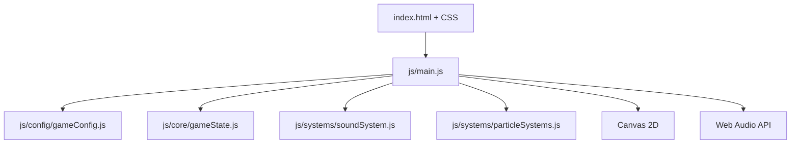
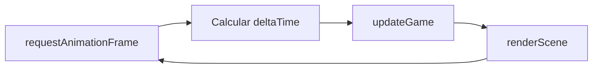
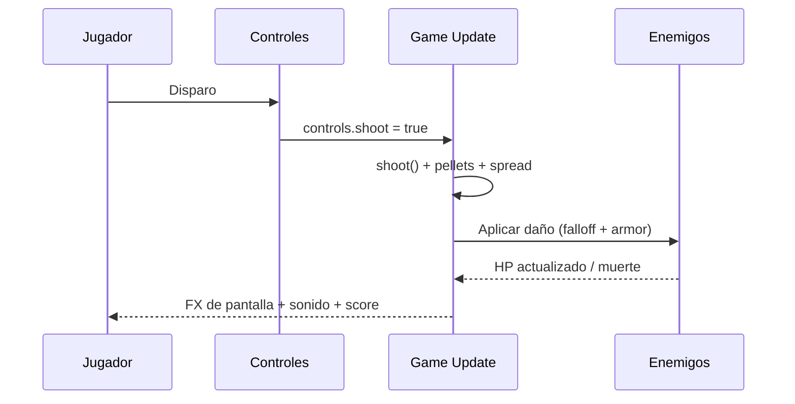
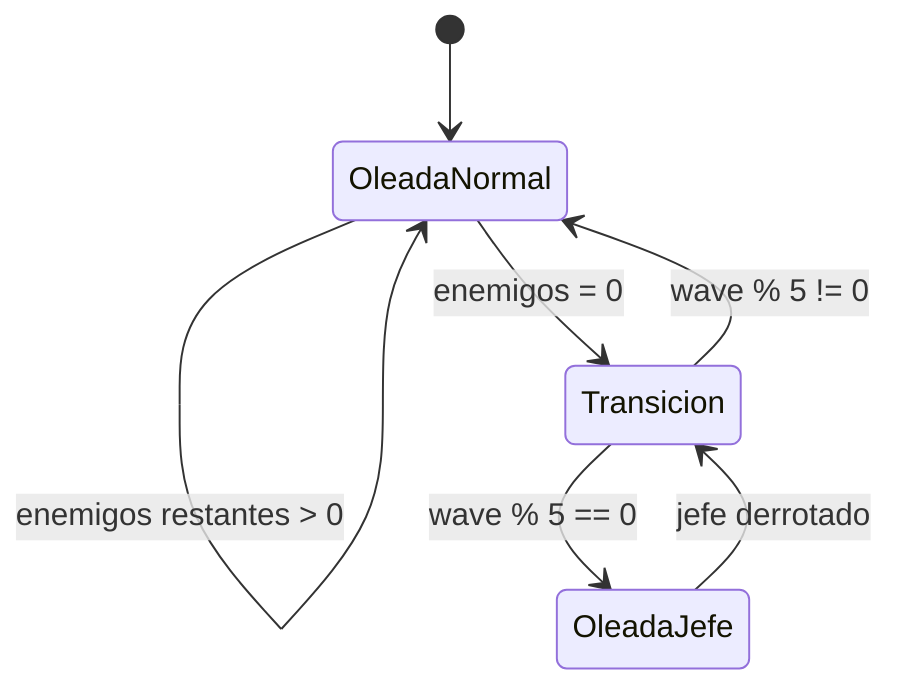

# 🎃 Hello Kitty Doom Hellsing Edition

Shooter retro en primera persona con **raycasting**, estética Halloween y modos visuales diferenciados para escritorio y móvil.


<div align="center">

[](https://jhormancastella.github.io/Hello-Kitty-Doom-Hellsing-Edition-/)

</div>

---

## 🧠 Descripción

Proyecto de videojuego estilo retro inspirado en motores clásicos de FPS por raycasting.  
La propuesta visual mezcla contraste “cute + horror” para ambientación temática de Halloween.

El juego incluye:

- Render 2.5D por raycasting en `canvas`.
- Sistema de oleadas con escalado progresivo y jefes.
- Armas con diferencias reales de comportamiento.
- IA enemiga con línea de visión y separación.
- Controles adaptados a escritorio y móvil.
- Sonido procedural con Web Audio API.
- Arquitectura modular en JavaScript ES Modules.

---

## ✨ Características principales

### 🎮 Gameplay

- Oleadas con dificultad creciente.
- Jefe cada 5 oleadas.
- Sistema de armas:
- `PISTOLA` (semi).
- `ESCOPETA` (pellets + dispersión).
- `RIFLE` (auto).
- Daño con caída por distancia y penetración de armadura.
- Recolección de ítems:
- Vida.
- Munición.
- Desbloqueo de armas.

### 🤖 IA y combate
- Persecución con rango de aggro.
- Ataque con validación de línea de visión (no atraviesa muros).
- Separación entre enemigos para evitar apilamiento.
- Comportamiento de orbitado/reposición en ciertas condiciones.

### 🧪 Render y efectos

- Escena 3D por raycasting.
- Sprites de enemigos y jefe con barra de vida.
- Mini mapa táctico.
- Efectos de daño y aviso de jefe.
- Partículas del mundo + partículas de pantalla:
- Fogonazo de disparo centrado.
- Sangre en impacto al enemigo.

### 📱 UX por dispositivo

- Detección automática de plataforma.
- Móvil estilo consola portátil con cruceta y botones `A/B/P`.
- Escritorio estilo CRT con overlays y HUD extendido.

---

## 🧰 Stack tecnológico

- Frontend:
- HTML5.
- CSS3.
- JavaScript ES6+ modular.
- APIs Web:
- Canvas 2D API.
- Web Audio API.
- Despliegue:
- GitHub Pages.

---

## 🗂️ Estructura actual del proyecto

```bash
Hello-Kitty-Doom-Hellsing-Edition-/
├── index.html
├── README.md
└── js/
    ├── main.js
    ├── config/
    │   └── gameConfig.js
    ├── core/
    │   └── gameState.js
    └── systems/
        ├── particleSystems.js
        └── soundSystem.js
```

---

## 🧱 Arquitectura modular

### `js/config/gameConfig.js`
- Constantes del juego:
- Armas.
- Ítems.
- Dificultades.
- Mapa.
- Límite de delta frame.

### `js/core/gameState.js`
- Clase `GameState`.
- Estado central: jugador, enemigos, oleada, ítems, score y flags de jefe.

### `js/systems/soundSystem.js`
- Clase `SoundSystem`.
- Sonidos y música procedural vía osciladores.

### `js/systems/particleSystems.js`
- `ParticleSystem` (partículas del mundo 3D).
- `ScreenParticleSystem` (partículas en pantalla: fogonazo/sangre).

### `js/main.js`
- Orquestación completa:
- Input.
- Update loop.
- Render loop.
- IA.
- Disparo.
- Colisiones.
- Spawns.
- UI/HUD.

---

## 🧭 Diagramas Mermaid

### Arquitectura del cliente


### Bucle principal


### Flujo de combate


### Ciclo de oleadas


---

## 🎛️ Controles

### Escritorio
- `W/S`: avanzar / retroceder.
- `A/D`: rotar cámara.
- `Q/E`: desplazamiento lateral.
- `Espacio`: disparar.
- `1/2/3`: cambio directo de arma (si está desbloqueada).
- `R`: ciclo de armas.
- `P`: pausa.
- `Enter`: iniciar partida desde splash.

### Móvil
- Cruceta:
- `↑/↓` avanzar y retroceder.
- `←/→` rotación.
- Botones:
- `B`: disparar.
- `A`: acción/cambio de arma.
- `P`: pausa.

---

## 🚀 Ejecución local

No requiere instalación de dependencias.

1. Clona el repositorio.
```bash
git clone https://github.com/jhormancastella/Hello-Kitty-Doom-Hellsing-Edition-.git
cd Hello-Kitty-Doom-Hellsing-Edition-
```

2. Ejecuta con servidor estático local.
```bash
# Opción Python
python -m http.server 8080
```

3. Abre en el navegador.
```text
http://localhost:8080
```

---

## 🌐 Despliegue

El proyecto está preparado para hosting estático.

- GitHub Pages:
- Rama `main`.
- Carpeta raíz.

URL oficial:

```text
https://jhormancastella.github.io/Hello-Kitty-Doom-Hellsing-Edition-/
```

---

## 📈 Rendimiento y decisiones técnicas

- Raycasting optimizado con control de densidad de rayos.
- Delta time con límite máximo para evitar saltos bruscos.
- Sistema de colisiones robusto con muestreo por radio.
- IA con separación para evitar sobreposición de entidades.
- Partículas desacopladas (mundo / pantalla) para mejor legibilidad visual.

---

## 🧩 Roadmap recomendado

- Separación de CSS en módulos (`base`, `layout`, `hud`, `effects`).
- Sistema de guardado de progreso local (LocalStorage).
- Nuevos tipos de enemigo con patrones específicos.
- Más mapas y selector de escenario.
- Menú de opciones (volumen, sensibilidad, calidad gráfica).
- Modo supervivencia infinito con tabla de puntuaciones.

---

## 🐞 Problemas comunes

### No se escucha audio
- Interactúa primero con la página (click/touch) para activar contexto de audio.

### Rendimiento bajo en móvil
- Reducir resolución de pantalla/zoom del navegador.
- Cerrar otras pestañas y apps en segundo plano.

### No carga alguna textura remota
- El sistema usa fallback local de canvas para evitar bloqueo total del juego.

---

## 📄 Licencia y derechos

Todos los derechos reservados a **Jhorman Jesús Castellanos Morales**.

Si deseas reutilizar partes del código o assets, solicita autorización previa.
